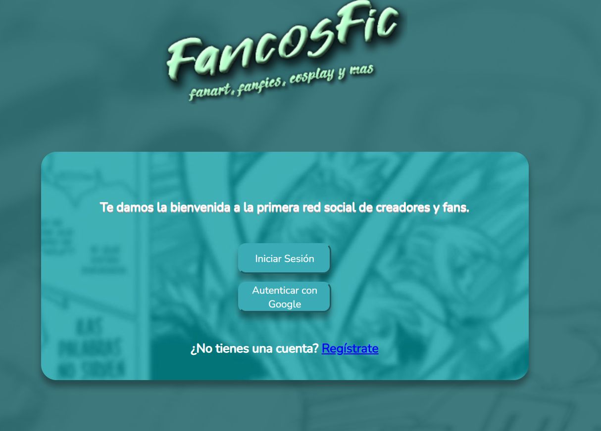
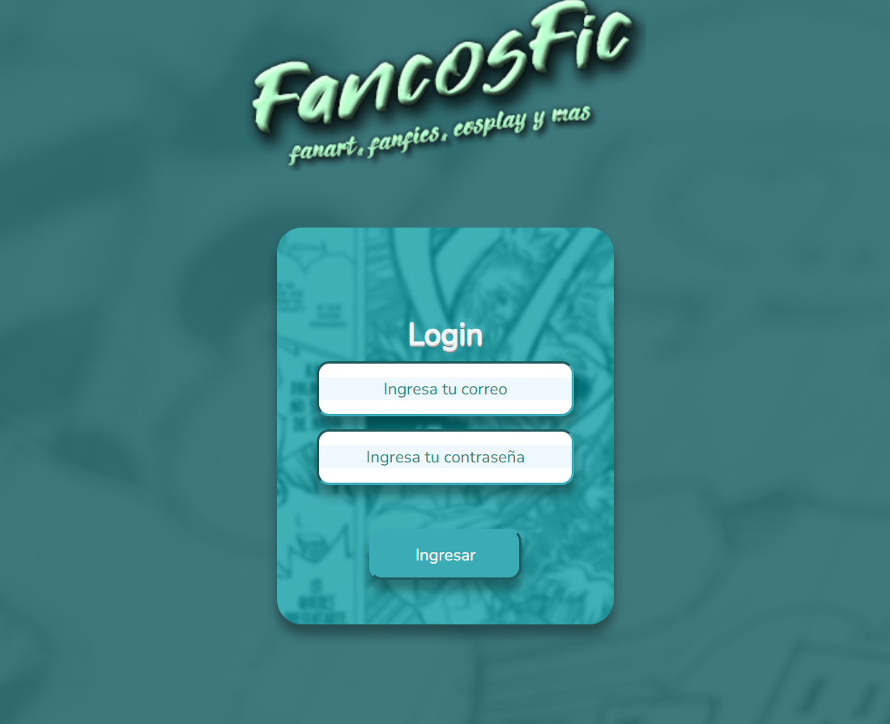
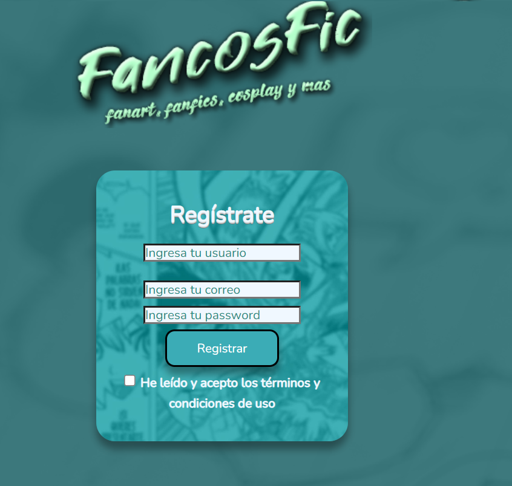
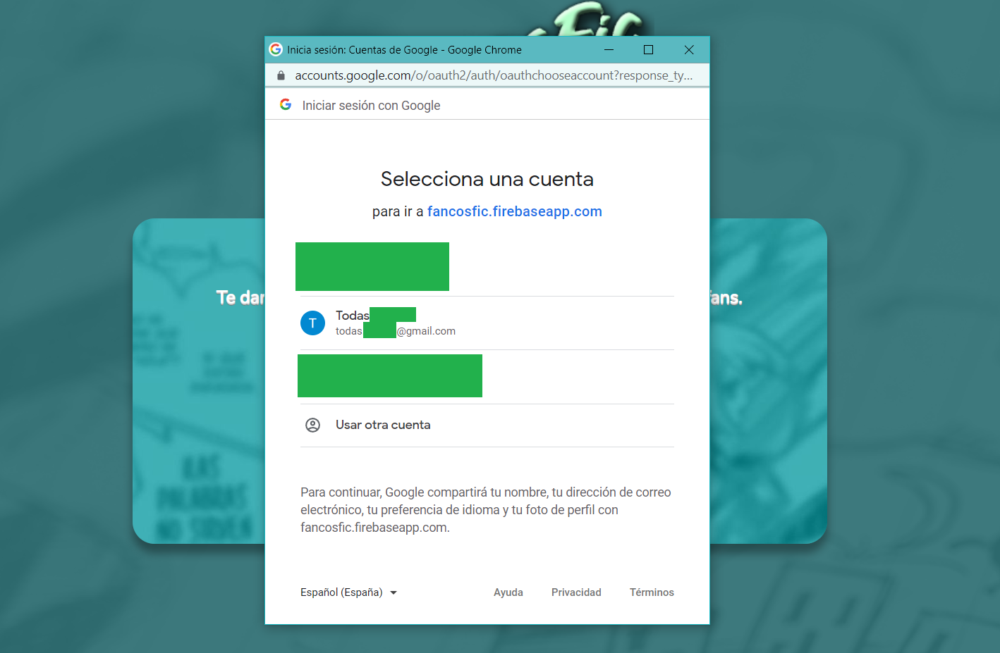
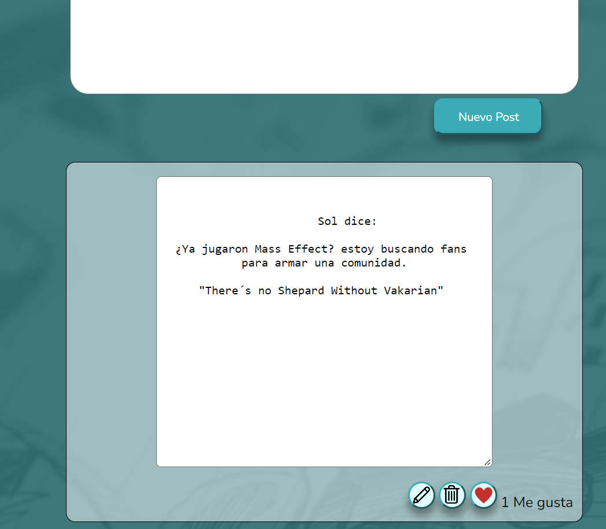
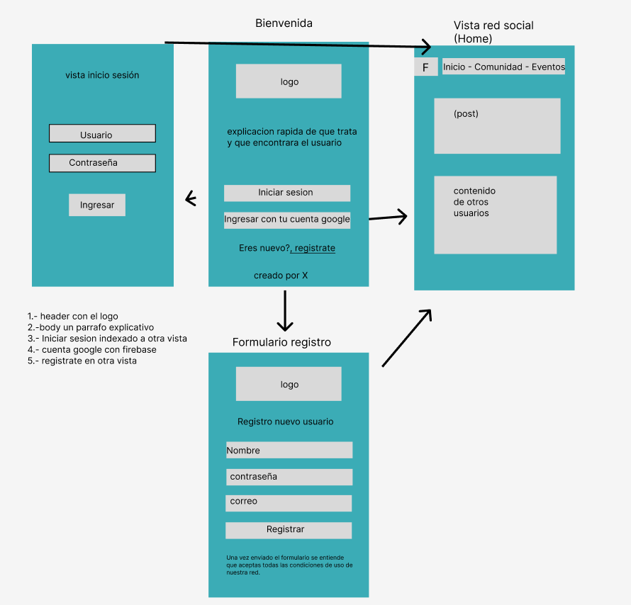
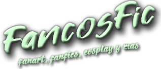
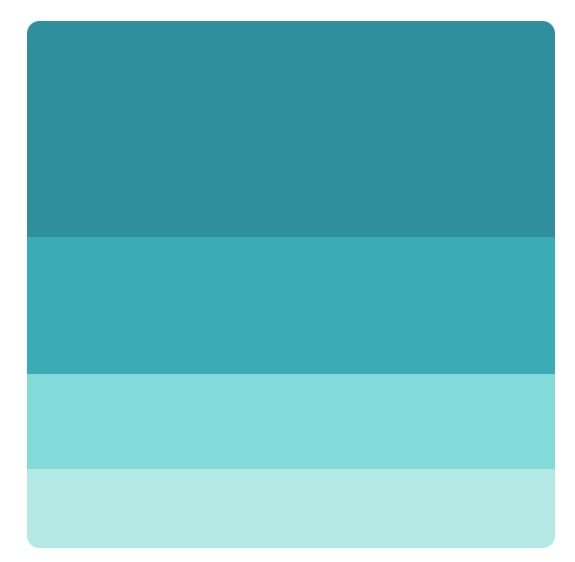
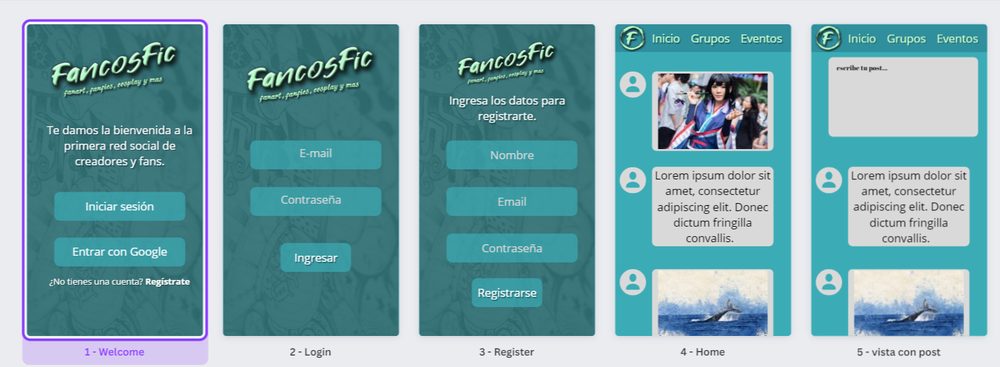
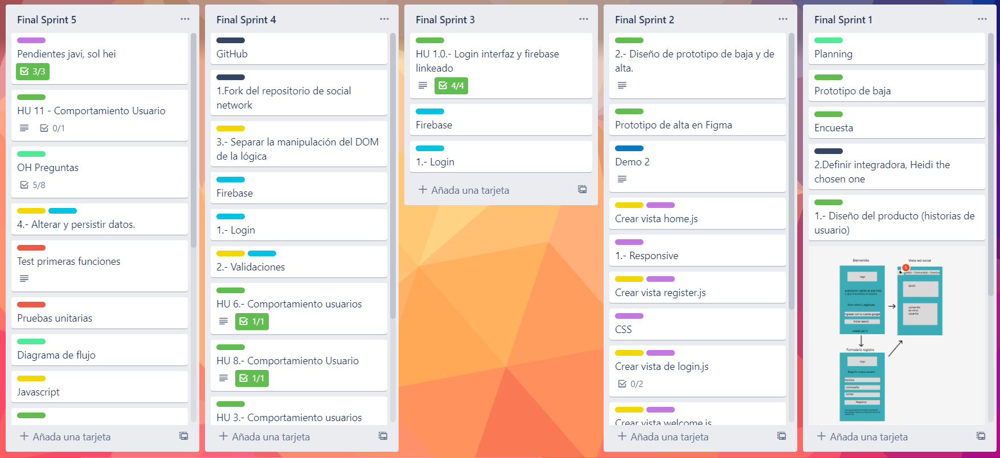

# FanCosFic (Proyecto Social Network)

## Resumen

**FanCosFic** Es una red social en donde podrás compartir con gente que comparte los mismos intereses que tú. El enfoque de FanCosFic es una comunidad en donde Fanfiquers, Cosplayers y Gamers se reúnan para compartir información, eventos y hacer grupos dentro de ella. Como usuario podrás interactuar en un Timeline en tiempo real, dar likes, subir publicaciones y participar activamente cuando y donde desees. 

***

## Presentación 
Experiencia usuario.

## Index para ingreso de usuario con varias alternativas.

## Pantalla Login

## Pantalla Register

## PopUp autenticación

## Home

## Investigación UX

* La investigación fue llevada a cabo a través de encuestas la cual fue respondida por una muestra de 40 personas. Todos de  distintas edades y género, entregándonos un abanico de posibilidades el cual nos ayudó a determinar el curso que tomaría FanCosFic. La información recopilada es la siguiente:

### Principales usuarios

* Rango etario es : 13 años a  50 años
* La mayoría mostró interés en participar en la red de manera activa.
* El interés también se enfocó en asistir a eventos u organizar juntas.

### Objetivos de estos usuarios en relación con el producto

* Los usuarios necesitan información clara y concisa,una interfaz que sea entendible y sin tantas vueltas.
* La red social sería un nexo con más gente.
* Hacer de FanCosFic una red social segura para compartir entre ellos.

### Diseño de Interfaz

* La parte visual tiene una parte importante, como son los colores ocupados, de la cual eligieron una paleta en tonos turquesas, los cuales harán la experiencia más amigable a la vista. 
* La interfaz debe ser de facil manejo, sin tanta información que distraiga al usuario del objetivo.

### Tiempos de uso

* Usarían nuestra app en sus tiempos de relajo y ocio. Calculamos que el uso de Fancosfic sería de un total de 2 horas diarias debido a la interacción en tiempo real.

### Prototipo de baja

* Una vez con la información recogida de la encuesta, se hizo el primer prototipo de baja, el cual fue testeado solo por el público objetivo con el cual trabajaríamos.

## Diseño

### Logo

* El logo y el diseño de la app, se trabajo desde cero ocupando Photoshop, adecuando los colores a la paleta elegida

### Paleta de colores

### Prototipo de alta

* Se realizaron las modificaciones que fueron entregadas por los futuros usuarios mediante encuesta, para posteriormente desarrollar el prototipo de alta fidelidad. Este también fue testeado por el público objetivo, para afinar detalles, los cuales fueron considerados en el desarrollo de app. Este se realizó de forma responsiva.

### Historias de Usuarios

* Luego de la investigación realizada, se trabajo en las historias de usuarios, las cuales se ejecutaron en distintos Sprint durante el desarrollo del proyecto. 
* Fueron en total 11 historias de usuarios, que se ejecutaron dentro de 5 Sprints.
* Cada historia usuario contaba con su criterio de aceptación y definición de terminado.
* La planificación se hizo mediante el software de administración de proyectos, TRELLO.

### Recursos ocupados

* Firebase.
* Firestore.
* Javascript Vanilla.
* Router.
* SPA.
* Trabajo con templates y manejo del DOM.

